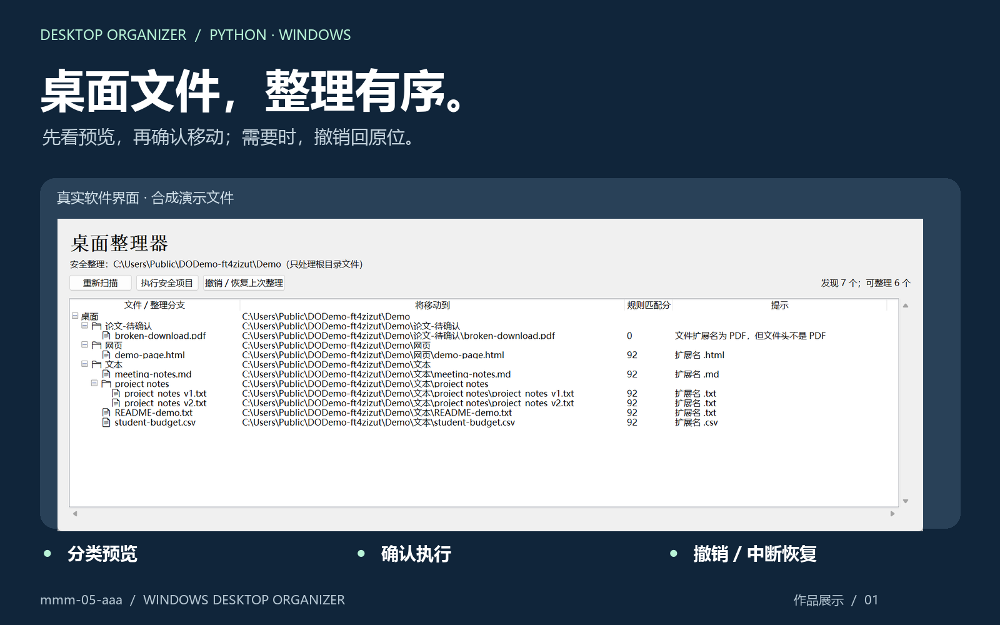
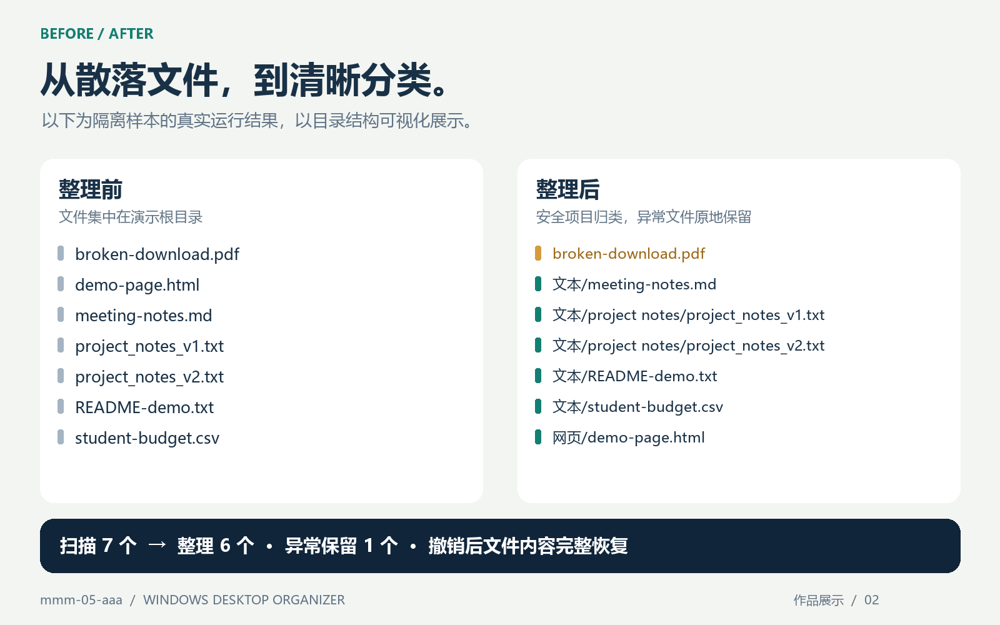

# 桌面整理器 · Desktop File Organizer

**先看预览，再确认移动；需要时，撤销回原位。**

一个本地运行的 Windows/Linux 文件整理工具，提供原生窗口和实验性 Web 界面。面向散落的文档、图片、音视频、网页和压缩包，不是资源管理器替代品，也不需要先编写规则配置。

[](https://github.com/mmm-05-aaa/desktop-file-organizer/actions/workflows/windows-tests.yml)
[](https://github.com/mmm-05-aaa/desktop-file-organizer/actions/workflows/cross-platform-packages.yml)
[MIT 许可证](LICENSE) · Windows/Linux x64 · Python 3.10–3.12 已测试



[快速开始](#快速开始) · [效果展示](#效果展示) · [使用指南](docs/USER_GUIDE.md) · [实现与测试](docs/ARCHITECTURE.md) · [反馈问题](https://github.com/mmm-05-aaa/desktop-file-organizer/issues/new/choose)

> **Alpha 候选版。** 提供 Windows x64 安装程序和 Ubuntu/Debian x64 `.deb`；重要文件请先备份，首次使用先运行合成演示；“可撤销”不等于备份。

## 它解决什么问题

手动把零散文件分门别类很繁琐，但直接自动移动又让人担心误归类。本工具把操作拆为 **扫描 → 预览 → 确认 → 整理 → 可选撤销**，让每次移动都有可查看的计划和恢复记录。

| 能力 | 实际行为 |
|---|---|
| 分类预览 | 树形显示类别、相近文件分组、目标路径、规则匹配分和警告 |
| 确认后整理 | 只执行当前预览中的安全项目，不在点击时偷偷重新扫描 |
| 异常保留 | 未知类型、低分、损坏 PDF 等项目保留并提示；规则匹配分不是准确率 |
| 撤销与恢复 | 核验文件身份与完整 SHA-256，保留连续整理历史，支持中断后确认恢复 |
| 两种入口 | Tkinter 原生界面；仅供本机使用的实验性 Web 界面 |

## 快速开始

### 安装包

在 [Releases](https://github.com/mmm-05-aaa/desktop-file-organizer/releases) 下载：

- Windows x64：`DesktopOrganizer-0.1.0-alpha-Windows-x64-Setup.exe`
- Ubuntu/Debian x64：`desktop-organizer_0.1.0~alpha_amd64.deb`

Linux 安装后可从应用菜单打开“桌面整理器”，或运行 `desktop-organizer`。`.deb` 在 Ubuntu 24.04 完成安装、真实 Tk 窗口启动和卸载验证；其他发行版暂未承诺。

### 1. 获取源码

在仓库页面选择 **Code → Download ZIP** 并解压，或在 **PowerShell** 中运行（需要 Git 和仓库访问权限）：

```powershell
git clone https://github.com/mmm-05-aaa/desktop-file-organizer.git
cd desktop-file-organizer
```

### 2. 检查环境

源码运行需要 **Windows 或 Linux、Python 3.10+ 和 Tkinter**，基础功能无第三方 Python 依赖。已在 Windows 和 Ubuntu CI 验证 Python 3.10 / 3.11 / 3.12。

在 **PowerShell** 中运行：

```powershell
python --version
python -c "import tkinter; print('Tkinter available')"
```

### 3. 先试演示，再处理自己的文件

双击 **`run_demo.bat`**，或在 **PowerShell、项目目录**运行：

```powershell
./run_demo.bat
```

它只扫描项目的 `demo-data`，不扫描真实桌面。查看预览后点击“执行安全项目”，体验完成后用“撤销 / 恢复上次整理”恢复。演示目录包含故意损坏的 PDF，用于展示警告和保留行为。

演示数据缺失时运行 `reset_demo.bat` **补齐**样本；它不会清空未知文件或覆盖修改过的样本。若刚整理过演示，优先撤销后再补齐。

准备处理真实桌面时，请先阅读[实际桌面、自定义目录和解释器设置](docs/USER_GUIDE.md#整理实际桌面)。Web 入口及可选 PDF 依赖也在[使用指南](docs/USER_GUIDE.md)中，不建议首次直接处理重要文件。

## 效果展示



对比图来自一次实际隔离运行：7 个样本，6 个被整理，1 个异常文件保留；撤销后文件内容完整恢复。**这是目录结构可视化，不是资源管理器截图。** 封面和[原始界面截图](screenshots/preview.png)使用合成数据，不含真实私人桌面内容。演示 ZIP 中的基础样本不包含对比图额外加入的两个版本分组样本。

## 安全边界

- 默认只看根目录文件，不递归整理已有文件夹；快捷方式、安装程序和部分临时文件跳过。
- 不覆盖竞争目标；拒绝符号链接、目录联接及不安全路径。
- 不提供网络盘、跨卷移动、云同步占位文件或多进程恶意篡改场景的完整保证。
- 已验证进程中断恢复，不宣称完成物理断电或磁盘故障认证。
- `pypdf` 为可选增强；缺少依赖时 PDF 保留。本轮未做真实 PDF 解析增强集成验证。
- 状态记录含本机路径，**不要上传事务日志或真实桌面截图**。旧状态不会自动删除或迁移。

详细行为见[使用指南](docs/USER_GUIDE.md#事务撤销和中断恢复)与[安全说明](SECURITY.md)。

## 开发与验证

在 **PowerShell、项目目录**运行：

```powershell
python -B -m unittest discover -s tests -v
```

[已核验的 Windows CI](https://github.com/mmm-05-aaa/desktop-file-organizer/actions/runs/34250722353)：Python 3.10、3.11、3.12 **每个版本 63 项通过，无跳过**。测试覆盖文件竞争、内容变化、事务恢复、跨进程锁、界面交互、HTTP 授权和便携启动。顶部徽章反映当前分支的最新 CI，不用静态“成功”图片冒充实时状态。

- [实现结构与验证方法](docs/ARCHITECTURE.md)
- [贡献指南](CONTRIBUTING.md) · [变更记录](CHANGELOG.md)
- [报告问题 / 提出建议](https://github.com/mmm-05-aaa/desktop-file-organizer/issues/new/choose)
- [发布前检查表](RELEASE_CHECKLIST.md)

## 许可证

[MIT](LICENSE) · Copyright © 2026 mmm-05-aaa。
