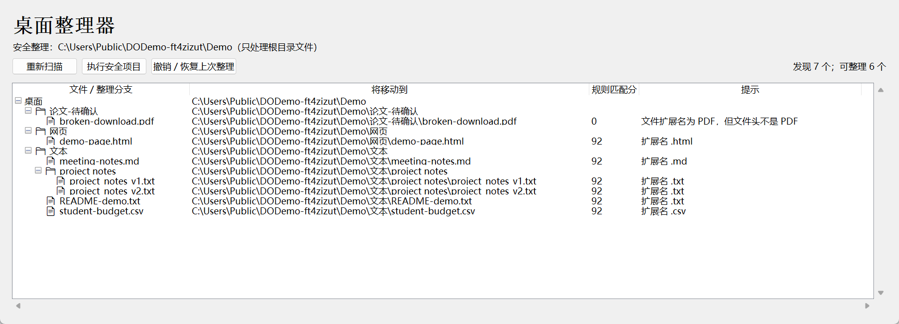

# 桌面整理器

一个本地运行的 Windows 桌面文件整理工具。**先扫描、看预览、确认后再移动；支持撤销与中断恢复。** 文档、图片、音视频、压缩包和网页分类是基础能力，PDF 主题识别是可选增强，不限定科研用途。

> 当前是修复候选版，不是生产级备份软件。重要文件请先备份，首次使用先运行隔离演示。尚未对外发布。



截图使用公共目录下的临时合成样本，窗口及列宽为展示调整；未显示真实用户桌面。

## 开始使用

需要 **Windows、Python 3.10+ 和 Tkinter**。本机验证 Python 3.11；GitHub 托管 Windows 已验证 Python 3.10、3.11 和 3.12。基础功能不需要第三方 Python 包，也不依赖 Hermes。

### 推荐：先运行隔离演示

双击 `run_demo.bat`。它只扫描项目的 `demo-data`，不扫描真实桌面。

脚本优先使用明确指定的解释器，其次检查 `py -3`，最后检查 `python`。会先检查版本，应用执行失败后不会换解释器重复执行。

如需指定 Python，以下命令在 **PowerShell、项目目录**运行：

```powershell
$env:DESKTOP_ORGANIZER_PYTHON = 'C:\Path To Python\python.exe'
.\run_demo.bat
```

`reset_demo.bat` 的行为是**补齐缺失的演示样本**，不是清空目录：未知文件、修改过的同名文件和已整理的子目录都会保留。若刚整理过演示数据，优先在软件中撤销，再补齐样本；直接补齐可能产生另一份演示样本，但不会删除旧文件。

### 整理实际桌面

在 **PowerShell、项目目录**运行：

```powershell
python organizer.py
```

程序通过 Windows Known Folder API 查询桌面位置，而不是假定桌面一定是 `%USERPROFILE%\Desktop`。指定其他现有绝对目录：

```powershell
$env:DESKTOP_ORGANIZER_ROOT = 'D:\My Files'
python organizer.py
```

不要把项目源码目录或装有重要文件的目录当作随意试验的演示根目录。空路径、不存在的目录以及链接/目录联接会被拒绝。

## 操作流程

1. **扫描**：只查看根目录文件，不深入已有文件夹。
2. **预览**：树形显示分类、相近文件分组、目标路径、规则匹配分及警告。
3. **确认执行**：只执行当前预览快照中无警告、规则匹配分达到 70 的项目；不会悄悄重新扫描后移动新文件。
4. **撤销 / 恢复**：按事务记录恢复原位置，并核验文件身份与完整 SHA-256 内容。

扫描与文件操作在后台线程执行，界面通过主线程接收结果；操作中禁止重复点击，也不会正常关闭正在操作的窗口。

### 分类与保留规则

- 分类：文档、文本、图片、压缩包、视频、音频、网页。
- 已有目录、快捷方式、安装程序、`desktop.ini`、Office `~$` 临时文件跳过。
- 未识别类型、低分、损坏 PDF 和其他带警告的文件留在原处。
- 重名时生成不冲突目标；执行期间新出现的同名目标也不会被覆盖。
- 相近文件名可分组，包括副本、数字后缀和版本号。

### 可选 PDF 增强

如需读取 PDF 前两页进行规则分类，可自行安装可选依赖（**PowerShell**）：

```powershell
python -m pip install pypdf
```

- 未安装 `pypdf`：PDF 留在原处，并明确提示缺少依赖；其他分类正常。
- 可读取的普通 PDF：归入文档。
- 主题规则有明确区分时：可建议论文主题目录。
- 主题分数接近、扫描件无文本、损坏或读取失败：保留并提示人工确认。

**规则匹配分不是统计概率或分类准确率。** 自动化测试包含分类决策与缺依赖边界；本轮本机未安装 `pypdf`，不把模拟分类输入测试宣称为真实 PDF 解析集成验证。

## 事务、撤销和中断恢复

- 移动前先原子保存事务意图，逐步更新每个文件的状态。
- 使用 Windows 不覆盖目标的重命名操作；不依赖“先判断不存在再覆盖”的实现。
- 普通执行故障尝试回滚；回滚失败或日志写入持续失败时保留记录并如实提示。
- 再次启动后，可用“撤销 / 恢复”处理未完成事务，恢复前仍要确认。
- 连续成功整理会保留历史记录，支持从最近一笔开始逐笔撤销。
- 存在未完成恢复的事务时，拒绝新整理，避免覆盖救援记录。
- 部分撤销成功后只保留未完成项，解决冲突后可以重试。
- 跨进程锁由操作系统持有；进程退出后自动释放。状态目录中的 `.lock` 文件不是“仍在运行”的证明，**不要因为它存在就删除它**。

状态按整理根目录隔离，保存在：

```text
%LOCALAPPDATA%\DesktopOrganizer\<root-id>\
```

演示目录与真实桌面不共享撤销记录。记录包含本机文件路径，**不能上传到公开仓库**。旧版本项目里的 `.state` 不会自动迁移或删除；保留它，确认旧记录中的操作已处理后再人工决定如何处置。未知版本、损坏或越界的日志拒绝自动恢复。

## 实验性 Web 界面

在 **PowerShell、项目目录**指定隔离目录后运行：

```powershell
$env:DESKTOP_ORGANIZER_ROOT = "$PWD\demo-data"
python web_app.py
```

浏览器访问 `http://127.0.0.1:8765/`。不要绑定公网、放到反向代理后或用于多人服务。

Web 入口使用同一核心事务逻辑，并具有：精确 Host/Origin 校验、请求令牌、显式确认、独立且限时的一次性计划、根目录绑定、请求体限制、请求超时和并发上限。多个页面的计划不会互相替换。未经授权的请求不能执行或撤销；预览通过 `textContent` 展示文件名，避免当成 HTML 执行。

## 测试

在 **PowerShell、项目目录**运行：

```powershell
python -B -m unittest discover -s tests -v
```

测试只操作临时文件和临时状态，不整理真实桌面。覆盖内容包含：

- 完整哈希、源/目标变更、竞争目标、越界与 Windows 目录联接；
- 日志故障、失败回滚、实际子进程中断、撤销中断后恢复、跨进程锁；
- 连续整理历史、部分撤销与多根目录隔离；
- Tkinter 确认取消、预览快照、树形分支、后台扫描和异常处理；
- 真实本地 HTTP 请求的授权、计划、超时和恢复流程；
- 演示文件保留、创建竞争、中文/空格路径的解释器与 BAT 返回码。

## 安全边界与已知限制

- 仅支持 Windows 本地文件操作，不提供网络盘、跨卷移动或云同步协作保证。
- 链接、目录联接及其他 reparse 路径保守拒绝；部分 OneDrive 按需文件也可能需要先复制到普通本地目录。桌面重定向 API 支持不等于所有云盘行为均已验证。
- 不防御拥有同一 Windows 用户权限、同时恶意替换父目录或篡改状态的进程；整理时不要让其他程序同时重构目标目录。
- 已测试进程中断恢复，不宣称已经实测物理断电、磁盘硬件故障或所有文件系统的持久性。
- 大文件会做完整哈希，复杂 PDF 读取也可能耗时；界面不会因此在主线程执行扫描，但不承诺实时完成。
- 分类仍需人工复核。不要把“可撤销”当作备份。

## 许可证与发布状态

采用 **MIT**，版权署名为 GitHub 账号 `mmm-05-aaa`。

GitHub 托管 Windows CI 的 **Python 3.10 / 3.11 / 3.12 均为 63 项测试通过，无跳过项**。本机与独立干净源码目录也均为 63 项通过。

[已核验 CI 运行及日志](https://github.com/mmm-05-aaa/desktop-file-organizer/actions/runs/34250348095)。

当前阶段为私有仓库验证，尚未公开发布或创建 Release。公开前须完成 CI 验证并取得维护者确认。发布前检查见 `RELEASE_CHECKLIST.md`。
